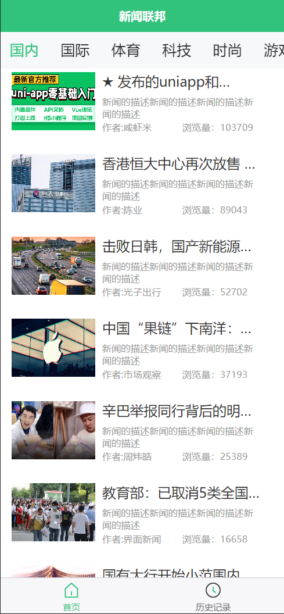
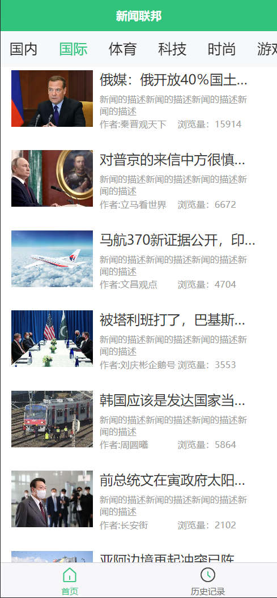
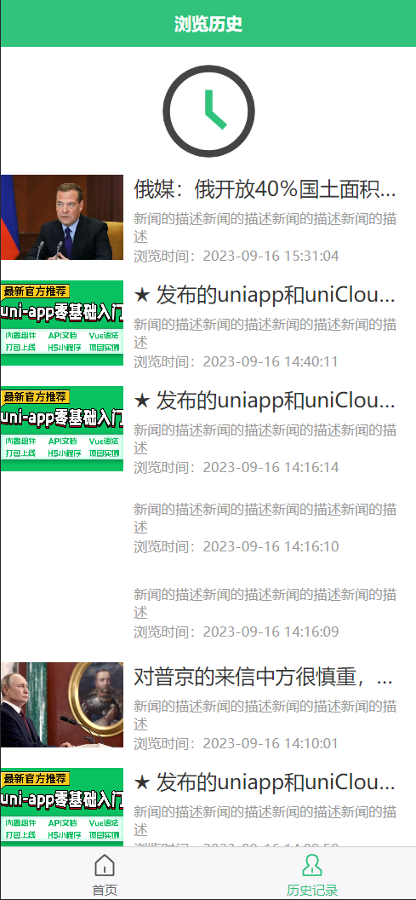

# readme

<div>
<p align="center">
  <a href="https://z.hui7.top/"></a>
</p>
</div>

<div align="center">

# 快看 新闻呀

*✨ 一个简易的新闻项目展示dome，支持H5，小程序。✨*

</div>

> **Note**  
> 本项目为开源项目，仅用于学习交流，不提供任何的商业服务。这是一个基于Hbuildx写的项目您可以直接导入并且编译部署到任何位置。项目中使用到[咸虾米](https://space.bilibili.com/381599106?spm_id_from=333.337.search-card.all.click)老师的数据接口，因为免费的接口且使用量大，可能会导致请求时会有数据请求慢，图片刷新慢，数据请求报错等原因，请多多谅解。

‍

> **Think**  
> 	此次项目是跟随B站UP主 [咸虾米](https://space.bilibili.com/381599106?spm_id_from=333.337.search-card.all.click)的[uniapp教学视频](https://www.bilibili.com/video/BV1mT411K7nW/?spm_id_from=333.999.0.0)时制作的小案例，感谢老师的能为我提供了很多免费优质教程（超级推荐）。引用老师的一句话：”大家没花钱没关系，请多按点赞转发支持我“。   ——致敬开源精神

‍

> **Warning**
>
> **	在拉取本项目时请您一定不要将项目页面中的声明删除。**请修改成您个人的邮箱，老师教学不易，请尽力支持。在项目中尽可能的保留老师的名字“[咸虾米](https://space.bilibili.com/381599106?spm_id_from=333.337.search-card.all.click)”让更多的人得以学习到优秀的课程。感谢

‍

|​​||​​​​|
||||
||||
| ---------------------------------------------------------------------------------| ----------------------| -------------------------------------------------------------------------------------|

‍

‍

## 功能

1. 历史浏览记录
2. 根据栏目显示不同的新闻
3. 查看新闻详情页
4. 栏目无内容时显示图片
5. 请求数据时底部显示文字

6. ......

‍

‍

## 项目说明

> 项目代码内有大量的注释，所以不用担心看不懂，可以跟着学习视频一边看一边写。

‍

使用的技术 ： uniapp+Vue2+less/scss

‍

主要学习知识点：

* 上滑刷新拼接与初始化
* 根据栏目请求数据
* 组件和页面的传递与接收数据
* 本地存储localStorage存储历史记录和获取
* 请求无数据显示特定内容
* 点击组件进入详情页
* 给组件添加点击事件
* 根据点击给对应的组件加Css样式
* 向数据接口请求数据并携带参数
* 生命周期函数的使用
* 通过富文本渲染HTML页面并设置图片比例
* 通过工具函数格式化时间戳成  日期格式
* 动态设置标题
* **获取到接口数据设置到本地的data中**！贼坑人
* success 回调箭头函数的使用
* 请求数据时自动翻页的写法。
* 根据传参组件差异化显示内容
* .......

‍

项目文件列表：

```html
YOUNGNEWSPROJECT
│  .gitignore - Git忽略文件列表
│  App.vue - 应用的根组件
│  index.html - 应用的入口HTML文件
│  main.js - 应用的主要JavaScript文件
│  manifest.json - uniapp应用的配置文件
│  pages.json - uniapp页面配置文件
│  uni.promisify.adaptor.js - 封装了uni-app异步API为Promise的适配器
│  uni.scss - 全局样式文件
│
├─.hbuilderx
│      launch.json - HBuilderX编辑器的调试配置文件
│
├─components - 组件目录
│  └─NewsList
│          NewsList.vue - 新闻列表组件
│
├─pages - 页面目录
│  ├─detail
│  │      detail.vue - 详情页面
│  │
│  ├─index
│  │      index.vue - 首页
│  │
│  └─userhistory
│          userhistory.vue - 用户历史页面
│
├─static - 静态资源目录
│  │  logo.png - 应用的logo图片
│  │
│  └─images - 图片资源目录
│          0.jpg
│          history.png
│          home-h.png
│          home.png
│          logo.png
│          mylogo.png
│          nodata.png
│          nohis.png
│          nopic.jpg
│          user-h.png
│          user.png
│
└─util - 工具目录
        tools.js - 工具函数文件

```

‍

‍

### 项目API接口

> 请求的是教程里的免费接口，所以大家不要过多频繁的请求接口。

[Apifox - 接口文档分享](https://apifox.com/apidoc/shared-8a725c57-c1a4-499f-823e-e133729efdf9/api-111159094)

​​

‍

## 下载运行教程

推荐一个 github加速神奇的库 ：[dotnetcore/FastGithub: github加速神器，解决github打不开、用户头像无法加载、releases无法上传下载、git-clone、git-pull、git-push失败等问题](https://github.com/dotnetcore/FastGithub)

‍

### 使用git拉取下载

在任意文件目录下打开cmd命令窗口,文件夹里 按着  Shift+鼠标右键.或者在当前文件路径中输入  `cmd`​​​

‍

​​

‍

‍

2. 初始化git  (希望你已经配置好全局的git信息，如果没配置可以百度查一查)

```js
git init
```

‍

3. 拉取代码 （如果拉取不下来 很可能是网络问题，必应搜： github加速下载！ ）

```js
git pull https://github.com/beidaomitu233/YoungNewsProject master
```

‍

## 从页面中直接下载

‍

​​

‍

‍

## 使用

1. 将项目导入到HbuildX中（其他编辑器就要自己探索了）

2. 运行即可  （不需要在意任何的选项 直接运行即可）

​​

‍

‍

‍

‍

‍

## 打包部署

### 手动打包部署

‍

1. 配置`manifest.json`​ 文件，根据您的需要 看着提示填就好了。 如果要在本地运行  ： 运行的基础路径填  `./`​

​​

‍

2. 可以打包成App 微信小程序和H5网页。

​​

‍

‍

‍

‍

### 宝塔部署H5教程

‍

添加站点。不需要配置数据库和php版本，默认即可。记得填写域名（与H5打包时域名相同）

​​

‍

3. 进入到网站运行目录上传打包后的文件  
    ​​

​​

‍

‍

‍

## 演示

### 在线演示

注意，该演示站不提供对外服务： https://z.hui7.top/

### 截图展示

​​​​​​

​​​​​​​  
​​

## 常见问题

‍

‍

‍

## 项目相关链接

‍

[uniapp和uniCloud全部: 零基础学习uniapp，进阶课程uniCloud等课堂练习源码已经项目案例，全部再对应目录中，有所帮助，请给个star吧~ - Gitee.com](https://gitee.com/qingnian8/uniall/tree/master/uniappBase)

‍

uniapp官方认可课程：

[咸虾米_的动态-哔哩哔哩 (bilibili.com)](https://t.bilibili.com/743201072382738436)

[新课uniapp零基础入门到项目打包（微信小程序/H5/vue/安卓apk）全掌握_哔哩哔哩_bilibili](https://www.bilibili.com/video/BV1mT411K7nW/?spm_id_from=333.337.search-card.all.click&vd_source=c48f6b6ef3cf472d854446c941ed0869)

## 注意

本项目使用 MIT 协议进行开源，**在此基础上**，必须在页面底部保留署名以及指向本项目的链接。

同样适用于基于本项目的二开项目。

依据 MIT 协议，使用者需自行承担使用本项目的风险与责任，本开源项目开发者与此无关。

‍
